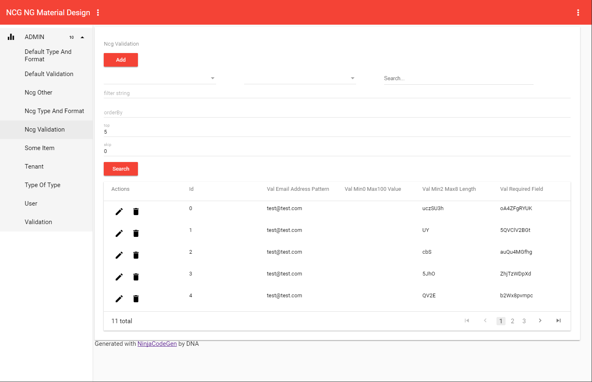

# NinjaCodeGen CRUD/Admin Angular 4+ Material Design App

## Getting Started

### Demo
[View Demo](https://ninjacodegen.github.io/ncg-crud-ngx-md/)

  <h4>Admin List View</h4>
  

  <h4>Admin Item View</h4>
  

### Quickstart

`npm install`

`npm start`

### Prerequisites
[Node.js](https://nodejs.org) and [Angular CLI](https://github.com/angular/angular-cli).

### Installing
Install Node.js from [https://nodejs.org](https://nodejs.org).

Install Angular CLI `npm install -g @angular/cli`

## Angular CLI
This project was generated with [Angular CLI](https://github.com/angular/angular-cli) version 1.0.0.

## NinjaCodeGen
This project was ninjafied with admin/CRUD, core, e2e codes through [NinjaCodeGen](https://ninjaCodeGen.com) ncg-bs template-set version 1.0.0.
 
To get more help on NinjaCodeGen, go check out our [website](https://ninjaCodeGen.com), [facebook](https://facebook.com/ninjaCodeGen), [twitter](https://twitter.com/ninjaCodeGen), [youtube](https://youtube.com/ninjaCodeGen).

## Built-with
* [Angular Material](http://github.com/angular/material) components can be used to create a good-looking production-ready app.
* [ngx-datatable](https://github.com/swimlane/ngx-datatable)
* [Flex-Layout](http://github.com/angular/flex-layout) directives (`fxLayout`, `fxFlex`, `fxLayoutGap`) can create advanced layouts.
* Material Design Icons
* [FontAwesome](http://fontawesome.io)

## Development server

Run `ng serve` for a dev server. Navigate to `http://localhost:4200/`. The app will automatically reload if you change any of the source files.
 
## Code scaffolding
 
Run `ng generate component component-name` to generate a new component. You can also use `ng generate directive/pipe/service/class/module`.
 
## Build
 
Run `ng build` to build the project. The build artifacts will be stored in the `dist/` directory. Use the `-prod` flag for a production build.
 
## Running unit tests
 
Run `ng test` to execute the unit tests via [Karma](https://karma-runner.github.io).
 
## Running end-to-end tests
 
Run `ng e2e` to execute the end-to-end tests via [Protractor](http://www.protractortest.org/).
Before running the tests make sure you are serving the app via `ng serve`.
 
## Further help
 
To get more help on the Angular CLI use `ng help` or go check out the [Angular CLI README](https://github.com/angular/angular-cli/blob/master/README.md).
